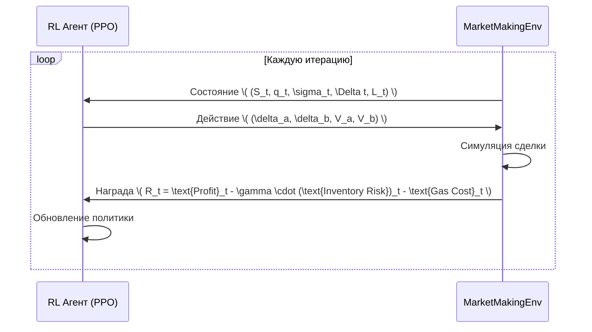

Для ответа на ваш запрос я добавлю все необходимые алгоритмы в виде Mermaid-диаграмм в формате Markdown. Эти диаграммы описывают ключевые процессы маркет-мейкинга для пар USD+/wETH и USD+/cbbtc с использованием модели Avellaneda-Stoikov (A-S), адаптации под onchain-торговлю и интеграции Reinforcement Learning (PPO). Каждая диаграмма сопровождается кратким описанием для ясности.

---

### 1. Базовая модель Avellaneda-Stoikov
Эта диаграмма показывает последовательность шагов для вычисления спредов покупки и продажи в модели A-S.

```mermaid
graph TD
    A[Получить данные с Binance] --> B[Вычислить mid-price \\( S_t \\)]
    A --> C[Вычислить волатильность \\( \sigma \\)]
    A --> D[Оценить интенсивность ордеров \\( k \\)]
    E[Получить текущий инвентарь \\( q_t \\)] --> F[Вычислить спреды]
    B --> F
    C --> F
    D --> F
    F --> G[Спред продажи \\( \delta_a = S_t + \frac{1}{\gamma} \ln(1 + \frac{\gamma}{k}) + q_t \cdot \sigma^2 T \\)]
    F --> H[Спред покупки \\( \delta_b = S_t - \frac{1}{\gamma} \ln(1 + \frac{\gamma}{k}) - q_t \cdot \sigma^2 T \\)]
```

**Описание:**
- Входные данные с Binance используются для расчета средней цены \( S_t \), волатильности \( \sigma \) и интенсивности ордеров \( k \).
- Текущий инвентарь \( q_t \) берется из системы управления.
- Спреды \( \delta_a \) (ask) и \( \delta_b \) (bid) вычисляются по формулам модели A-S, учитывая риск и инвентарь.

---

### 2. Адаптация под onchain-торговлю
Эта диаграмма иллюстрирует корректировку спредов A-S с учетом специфики блокчейна (latency, gas costs, ликвидность пула).

```mermaid
graph TD
    A[Получить базовые спреды \( \delta_a, \delta_b \) из A-S] --> B[Получить onchain-метрики]
    B --> C[Gas price]
    B --> D[Latency \( \Delta t \)]
    B --> E[Глубина пула \( L_t \)]
    D --> F[Скорректировать \( S_t \) с учетом latency]
    F --> G[\( S_{t+\Delta t} = S_t + \epsilon \), где \( \epsilon \sim N(0, \sigma \sqrt{\Delta t}) \)]
    G --> H[Обновить спреды с учетом \( S_{t+\Delta t} \)]
    C --> I[Рассчитать gas cost]
    I --> J[Добавить штраф за gas cost к спредам]
    E --> K[Адаптировать спреды под кривую PMM]
    H --> L[Финальные спреды для onchain]
    J --> L
    K --> L
```

**Описание:**
- Базовые спреды из A-S корректируются с учетом onchain-факторов.
- Latency моделируется через случайное отклонение цены \( S_{t+\Delta t} \).
- Gas costs добавляются как дополнительный штраф к спредам.
- Спреды адаптируются к кривой ликвидности пула PMM (Proactive Market Making).

---

### 3. Интеграция Reinforcement Learning (PPO)
Диаграмма последовательности показывает взаимодействие RL-агента (PPO) с окружающей средой для оптимизации спредов и объемов.



**Описание:**
- Среда передает агенту текущее состояние: цена \( S_t \), инвентарь \( q_t \), волатильность \( \sigma_t \), задержка \( \Delta t \), ликвидность \( L_t \).
- Агент выбирает действие: спреды (\( \delta_a, \delta_b \)) и объемы (\( V_a, V_b \)).
- Среда симулирует сделку и возвращает награду, учитывающую прибыль, риск инвентаря и затраты на газ.
- Агент обновляет политику для максимизации награды.

---

### 4. Общий алгоритм маркет-мейкинга
Эта блок-схема объединяет все компоненты в единый цикл маркет-мейкинга.

```mermaid
graph TD
    A[Старт] --> B[Получить данные с Binance]
    B --> C[Вычислить \( S_t, \sigma, k \)]
    C --> D[Получить onchain-метрики]
    D --> E[Вычислить базовые спреды A-S]
    E --> F[Адаптировать спреды под onchain]
    F --> G[Получить состояние для RL]
    G --> H[RL-агент выбирает действие]
    H --> I[Разместить ордера в PMM-пуле]
    I --> J[Обновить инвентарь]
    J --> K[Рассчитать награду]
    K --> L[Обновить RL-агента]
    L --> M[Повторить цикл]
```

**Описание:**
- Данные с Binance и onchain-метрики используются для расчета базовых спредов по модели A-S.
- Спреды адаптируются под условия блокчейна.
- RL-агент выбирает оптимальные спреды и объемы на основе текущего состояния.
- Ордера размещаются в пуле PMM, инвентарь обновляется, а агент обучается на основе награды.

---

Эти Mermaid-диаграммы полностью описывают алгоритмы маркет-мейкинга, включая базовую модель A-S, адаптацию под onchain-торговлю и интеграцию RL с PPO. Каждая диаграмма визуализирует ключевые шаги и их взаимодействие, обеспечивая ясное понимание процесса.